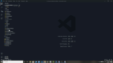

# E-Commerce

## Description

Internet retail, also known as e-commerce, is the largest sector of the electronics industry, generating an estimated $29 trillion in 2019. E-commerce platforms like Shopify and WooCommerce provide a suite of services to businesses of all sizes. Due to their prevalence, understanding the fundamental architecture of these platforms will benefit you as a full-stack web developer.

Your task is to build the back end for an e-commerce site by modifying starter code. You’ll configure a working Express.js API to use Sequelize to interact with a MySQL database.

Because this application won’t be deployed, you’ll also need to provide a link to a walkthrough video that demonstrates its functionality and all of the acceptance criteria being met. You’ll need to submit a link to the video and add it to the readme of your project.

## Table of Contents
  * [Installation](#installation)
  * [Technology](#technology)
  * [Usage](#usage)
  * [Links](#links)
  * [License](#license)
  * [Contributions](#contributions)
  * [Tests](#tests)
  * [Questions](#questions)
  
  
## Installation

- You must install Both Node.js and MySQL on your computer.
- Navigate to the root directory and run: 
- `npm install`
- To start the server, in the command line run: 
- `npm start`

## Technology

- Node
- Express
- MySQL
- Sequelize
- Dotenv

## Usage

- Navigate to the root directory and run: 
- `npm install`
- To start the server, in the command line run: 
- `npm start`

  
 
 ## Links
 
  * Application URL: (https://chloeyu17.github.io/ecommerce/)
  * Github Repository URL: (https://github.com/chloeyu17/ecommerce)

## Contributions

  

  